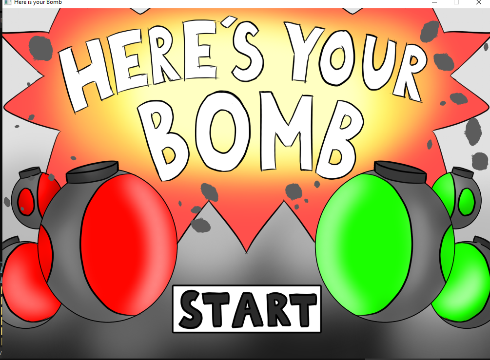
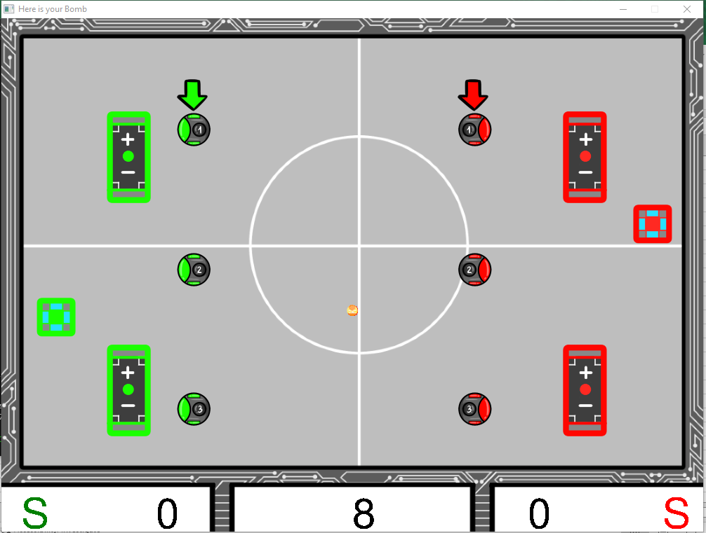
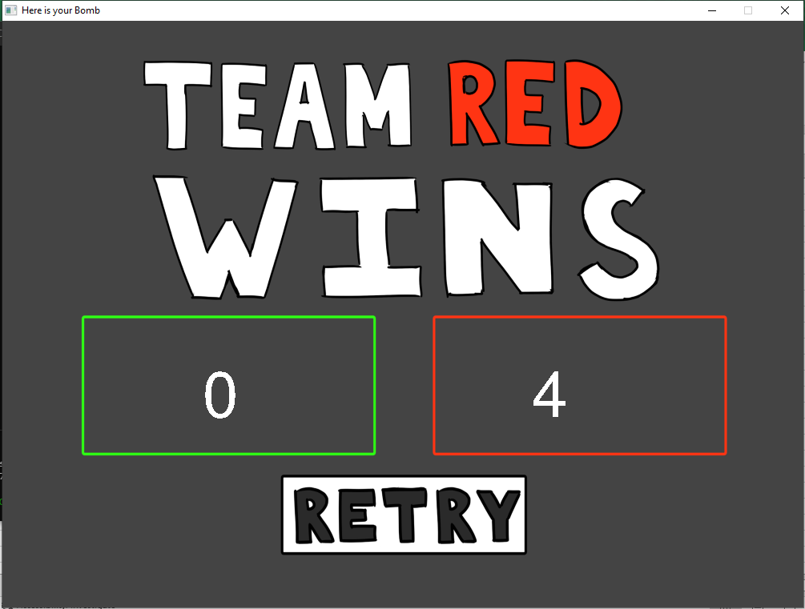

# Here-is-your-bomb-game_SDL-Cpp

 A game built use library SDL2.0 of C++ 

`SDL2.h  &  SDL2_image.h  &  SDL2_mixer.h  &  SDL2_ttf.h SDL2_gfxPrimitives.h`  
Use will need to install library file to include and .dll file for .exe to run.  

